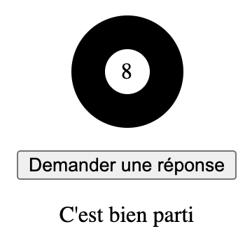

# S7 – Jeu: Pizza Mystère

Objectif: Découvrir et augmenter ensemble un mini-jeu de pizzeria avec un client indécis.

La base de code est étudiée en cours, elle sert de support aux exercices.

## Résumé

Un jeu dans lequel le joueur incarne un pizzaïolo.
Celui doit deviner la bonne recette de pizza pour un client indécis et peu communicatif.

Le jeu est gagné dès que le client est satisfait.

## Déroulement

1. Un client se présente et demande une pizza
2. Le joueur choisi plusieurs garnitures parmi un choix prédéfini
3. Il propose cette pizza au client qui réagi positivement ou négativement en fonction de la recette proposée.
Seulement trois types de réponses sont possibles:
    1. Trop ou pas assez d'ingrédients
    2. Le client n'aime pas un des ingrédients proposés
    3. C'est la bonne pizza, le client est content ! (fin de la partie)

## Implémentation en trois phases

1. Initialisation (des variables et références)
2. Mise en place (des éléments, fonctions et événements)
3. Interaction (avec l'utilisateur)

## Documentation

Méthodes de tableau utilisées
- [.sort()](https://developer.mozilla.org/fr/docs/Web/JavaScript/Reference/Objets_globaux/Array/sort)
- [.slice()](https://developer.mozilla.org/fr/docs/Web/JavaScript/Reference/Objets_globaux/Array/slice)
- [.push()](https://developer.mozilla.org/fr/docs/Web/JavaScript/Reference/Objets_globaux/Array/push)
- [.join()](https://developer.mozilla.org/fr/docs/Web/JavaScript/Reference/Objets_globaux/Array/join)
- [.includes()](https://developer.mozilla.org/fr/docs/Web/JavaScript/Reference/Objets_globaux/Array/includes)

Nombre aléatoire
- [Math.random()](https://developer.mozilla.org/fr/docs/Web/JavaScript/Reference/Objets_globaux/Math/random)


## Aide

<details>
    <summary>Comment retourner une valeur aléatoire d'un tableau ?</summary>

Utilisez `Math.random()` :

```javascript
let valeurAuHasard = monTableau[Math.floor(Math.random() * monTableau.length)];
```

Math.random() retourne une valeur à virgule flottante entre 0 et 1 (sans jamais retourner exactement 1). 
Il suffit de multiplier cette valeur par la longueur du tableau et d'arrondir le tout à la valeur inférieure.

Conseil: expérimentez dans la console de votre navigateur.
</details>


## Exercices

En guise d'exercices, nous vous proposons de réaliser des ajouts et modifications sur la base de code existante: [pizza-mystere-base.html](données/pizza-mystere-base.html)

Copiez ce fichier dans le dossier `travail-personnel` de la semaine afin de conserver l'original et ne pas risquer de conflits avec GitHub.

Libre à vous de choisir en fonction des exercices si vous partez du fichier original ou continuez sur le même fichier pour augmenter le jeu de manière incrémentale avec toutes les nouvelles fonctionnalités.

Trois catégories d'exercices: *Facile*, *Moyen*, *Avancé* (*F*x, *M*x, *A*x)

**Conseil**: Utilisez la console de votre naviguateur pour débugguer votre code et voir les éventuelles erreurs !


### F1: Continuer le jeu avec nouvelle recette mystère

Lorsque que le jeu est gagné, changer la recette mystère automatiquement afin de pouvoir continuer de jouer.

<details>
    <summary>Indice 1</summary>

Le test de condition "jeu gagné" existe déjà aux lignes 168-170.

Que pouvez-vous faire ici pour renouveller la recette mystère ?
</details>

<details>
    <summary>Indice 2</summary>

La fonction `créerPizzaMystère` peut être appelée plus d'une fois...
</details>

<details>
    <summary>Solution</summary>

Ajouter un simple appel à la fonction existante `créerPizzaMystère` dans la condition aux lignes 168-170.

```javascript
// Si pas de réponse jusqu'ici, c'est gagné !
if (réponse == undefined) {
    réponse = '😋 Oui, merci !';
    créerPizzaMystère();
}
```
</details>

### F2: Gagner avec plus d'impact

Lorsque le jeu est gagné, au lieu d'afficher un texte en regard de la proposition, afficher une alerte du navigateur.

<details>
    <summary>Indice</summary>

Consultez la documentation de [window.alert()](https://developer.mozilla.org/fr/docs/Web/API/Window/alert)
</details>

<details>
    <summary>Solution</summary>

Remplacez la ligne 169 avec un appel à `alert()`

```javascript
// Si pas de réponse jusqu'ici, c'est gagné !
if (réponse == undefined) {
    alert('😋 Oui, merci !');
}
```
</details>

### F3: Un repas léger

Ajoutez une condition de test lors de la proposition. Si la recette proposée ne contient que de la pâte à pizza, le client vous fait une remarque désobligeante.

<details>
    <summary>Indice 1</summary>

Dans la fonction `proposerPizza`, inspirez-vous des conditions existantes et ajoutez-en une nouvelle.
</details>

<details>
    <summary>Indice 2</summary>

Pour cette condition, l'ordre dans lequel les conditions sont testées peut avoir son importance !
</details>

<details>
    <summary>Solution</summary>

Ajoutez, au moins après le premier test de condition (pas assez), une nouvelle condition qui teste si la longueur de la recette proposée est égale à zéro :

```javascript
if (recette.length == 0) {
    réponse = '😕 Je ne vous ai pas demandé un apéritif !';
}
```
</details>


### M1: Bouton commencer nouvelle partie

Ajoutez un bouton pour commencer une nouvelle partie.

Cela comprend:
- Créer un bouton et son comportement.
- Créer une nouvelle recette mystère.
- Effacer l'historique de la conversation.


### M2: Réponses alternatives du client

Pour chaque condition de réponse du client (trop d'ingrédients / pas assez / n'aime pas), ajouter des réponses alternatives et affichez-en une au hasard lorsque le cas se présente.

<details>
    <summary>Indice 1</summary>

Utilisez un tableau pour lister les réponses alternative à chaque cas.
</details>

<details>
    <summary>Indice 2</summary>

Trois cas, trois tableaux
</details>

Comment retourner une valeur aléatoire d'un tableau ?
Consultez l'aide dans la section relative plus haut dans ce fichier.


### M3: Choisir la difficulté du jeu

Ajoutez trois boutons pour choisir la difficulté:
- facile: la recette mystère contient 2 garnitures
- moyen: 3 garnitures
- difficile: 4 garnitures

<details>
    <summary>Indice 1</summary>

Utilisez une variable pour stocker le niveau de difficulté (le nombre d'ingrédient).
</details>

<details>
    <summary>Indice 2</summary>

Lorsque la difficulté est définie, la recette mystère doit être générée à nouveau.
</details>

<details>
    <summary>Indice 3</summary>

Dans la fonction `créerPizzaMystère` la difficulté actuelle est écrite en dur.
Faut-il la remplacer par une variable ?
</details>


### A1: Plus de garnitures, moins de choix

Ajoutez plus de garnitures au tableau idoine et modifiez la fonction `afficherLesGarnitures()` afin que 6 garnitures seulement soient sélectionnées au hasard pour la partie en cours.

<details>
    <summary>Indice 1</summary>

Inspirez-vous de la fonction `créerPizzaMystère()`.
</details>

<details>
    <summary>Indice 2</summary>

Renommer le tableau original `garnitures` afin de pouvoir réutiliser cet identifiant pour stocker les 6 garnitures au hasard dans `afficherLesGarnitures`.
</details>


### A2: Nom du client aléatoire

Au début de chaque nouvelle partie, donnez un nom aléatoire au client. Remplacez `Un client entre...` par `Monsieur Hulot entre...` p.ex.

<details>
    <summary>Indice 1</summary>

Utilisez un tableau pour lister les noms que vous créez comme nous l'avons fait avec les garnitures.
</details>

<details>
    <summary>Indice 2</summary>

Peut-être devriez-vous ajouter un `<span>` avec `id` en début de phrase pour faciliter l'injection du nom du client ?
</details>

Comment retourner une valeur aléatoire d'un tableau ?
Consultez l'aide dans la section relative plus haut dans ce fichier.


### A3: Colorer les garnitures

Transformez le tableau des garnitures en tableau à deux dimensions: chaque élément du premier tableau étant lui-même un tableau possédant deux valeurs:
- la première contient le nom de la garniture
- la seconde contient une couleur de votre choix.

Appliquez la couleur comme couleur de fond au `<span>` correspondant.

<details>
    <summary>Indice</summary>
Exemple de tableau à deux dimensions

```javascript
const garnitures = [
    ['Jambon', 'lightcoral'],
    ['Champignons', 'rosybrown'],
    // ...
];
```
</details>


### A4: Empêcher de mettre plusieurs fois la même garniture

Le code actuel permet de mettre plusieurs fois la même garniture sur la pizza ! Puisque chaque pizza mystère est composée de garnitures différentes, empêchez l'utilisateur de proposer plusieurs fois la même garniture.

Ceci implique plusieurs étapes :
* Garder une trace des garnitures choisies jusqu'à présent.
* Vérifier que la garniture cliquée soit différente que les garnitures déjà choisies.
* Signaler à l'utilisateur qu'une garniture est déjà choisie s'il s'apprête à mettre une garniture déjà sur la pizza.
* S'assurer de vider la liste des garnitures choisies lorsque l'utilisateur valide la pizza.

<details>
    <summary>Indice 1</summary>

Il va falloir trouver un moyen de garder une trace des garnitures cliquées par l'utilisateur. Avec un tableau par exemple ?

```javascript
// tableau contenant les garnitures que le pizzaiolo a mis sur la pizza.
const garnituresChoisies = [];
```
</details>

<details>
    <summary>Indice 2</summary>

Une fois que l'on garde une trace des garnitures cliquées par l'utilisateur, vérifier, lors d'un clic sur une garniture, que la garniture cliquée n'est pas dans la liste de celles déjà cliquées.

Modifiez la fonction `choisirGarniture()`. Essayez avec `.includes()`.
</details>

<details>
    <summary>Indice 3</summary>

Attention ! Il faudra vider la liste des garnitures cliquées à chaque fois que l'utilisateur valide la pizza, **qu'elle soit correcte ou non**.
</details>


### Exercice bonus: Boule magique

Maintenant que vous êtes familier avec la manipulation de tableaux et le tirage de nombres au hasard, peut-être voulez-vous essayer de créer un autre jeu de toute pièce: Un boule magique !

En vous inspirant du jeu Pizza Mystère, reproduisez ceci:



Lorsque l'on clique sur le bouton "Demander une réponse", un texte aléatoire apparaît en dessous (ici: "C'est bien parti").

Solution: [boule-magique.html](solutions/boule-magique.html)
